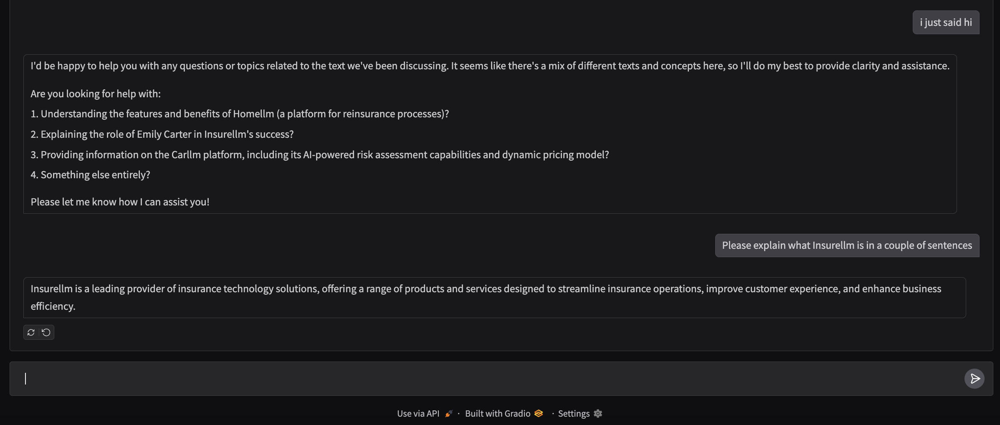

# 🧠 Ollama RAG Chatbot

A **Retrieval-Augmented Generation (RAG) chatbot** using **Ollama** as the LLM and **ChromaDB** as the vector store. This chatbot can retrieve and generate responses based on a custom knowledge base.

---

## 🚀 Features
✅ Uses **Ollama** to run Llama models locally.  
✅ Implements **ChromaDB** for efficient text retrieval.  
✅ Supports **LangChain** for document processing.  
✅ Simple **Gradio UI** for chat interaction.  

---

